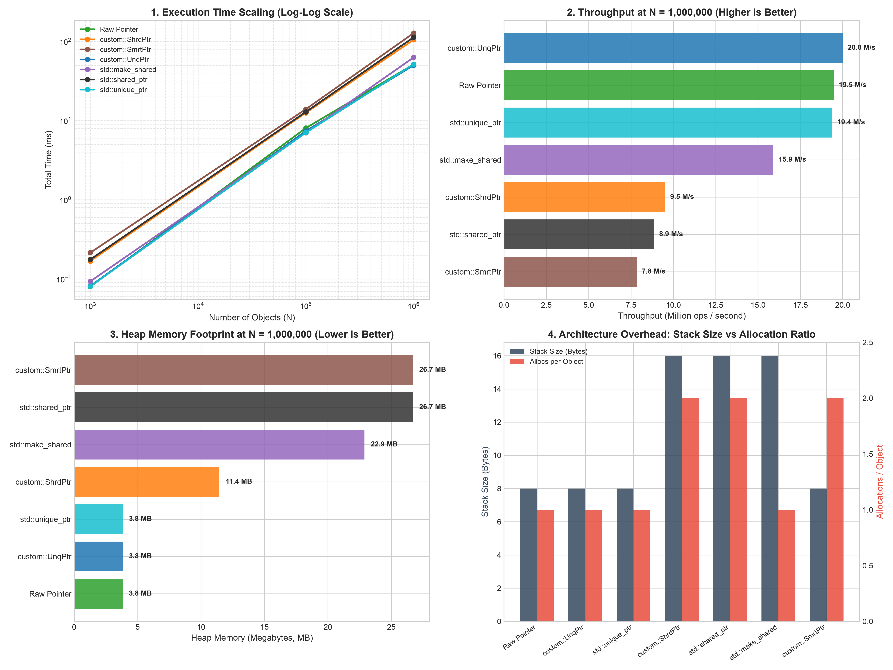

# Нелинейные структуры (Лабораторная работа №0 - Smart Pointers)

Данный проект собой законченную библиотеку пользовательских умных указателей на стандарте **C++20**, реализующую различные парадигмы управления ресурсами (RAII): эксклюзивное владение, децентрализованное разделяемое владение, централизованное хранение в реестре и безопасную арифметику указателей с контролем границ. 

## Сборка и запуск

Проект использует систему сборки **CMake** (версия 3.20+) и компилятор с поддержкой C++20 (Apple Clang / Clang / GCC). Все команды выполняются из корневой директории проекта.

### 1. Сборка проекта


**Режим Debug (с включенным AddressSanitizer для отлова ошибок памяти):**

```bash
cmake -B build -DCMAKE_BUILD_TYPE=Debug
cmake --build build
```

Режим Release (с оптимизациями -O3 для нагрузочных бенчмарков):

```bash
cmake -B build -DCMAKE_BUILD_TYPE=Release
cmake --build build
```

### 2. Запуск модульных тестов (Google Test)

```bash
# Запуск полного набора unit-тестов (22 теста)
./build/unit_tests

# Запуск с фильтрацией по конкретному модулю
./build/unit_tests --gtest_filter="UnqPtrTest.*"
./build/unit_tests --gtest_filter="ShrdPtrTest.*"
./build/unit_tests --gtest_filter="SequenceTest.*"
./build/unit_tests --gtest_filter="SmrtPtrTest.*"
./build/unit_tests --gtest_filter="MemorySpanTest.*"
./build/unit_tests --gtest_filter="MsPtrTest.*"
```

### 3. Запуск бенчмарков и построение графиков

```bash
# Запуск C++ бенчмарка (генерация консольной таблицы и benchmark_results.csv)
./build/benchmarks

# Автоматическая генерация аналитического дашборда на Python (через uv):
uv run --with pandas --with matplotlib python scripts/plot_benchmarks.py

# Либо через стандартный python (если установлены matplotlib и pandas):
python3 scripts/plot_benchmarks.py

uv run scripts/plot_benchmarks.py
```

## Структура проекта

```
├── include/
│   ├── Concepts.hpp                 # C++20 концепты для подтипизации (Upcasting)
│   ├── UnqPtr.hpp / .tpp            # Эксклюзивный указатель UnqPtr<T> и UnqPtr<T[]>
│   ├── ShrdPtr.hpp / .tpp           # Разделяемый указатель ShrdPtr<T> и ShrdPtr<T[]>
│   ├── CentralStorage.hpp           # Реестр подсчета ссылок (Meyers' Singleton)
│   ├── SmrtPtr.hpp / .tpp           # Централизованный умный указатель SmrtPtr<T>
│   ├── MsPtr.hpp / .tpp             # Безопасный Fat-Pointer с арифметикой указателей
│   ├── MemorySpan.hpp / .tpp        # Безопасный непрерывный буфер памяти
│   └── DynamicArraySequence.hpp/.tpp# Демонстрационный контейнер Sequence на UnqPtr
├── src/
│   └── CentralStorage.cpp           # Реализация синглтона реестра
├── tests/
│   └── test_main.cpp                # 22 модульных теста (GTest) + проверка утечек
├── benchmarks/
│   └── bench_main.cpp               # Нагрузочное тестирование (1K, 100K, 1M)
├── scripts/
│   └── plot_benchmarks.py           # Скрипт визуализации 4-панельного дашборда
├── .gitignore
├── CMakeLists.txt
└── README.md
```

## Архитектура и детали реализации

### 1. Подтипизация на концептах C++20 (`Concepts.hpp`)
В соответствии с требованием ТЗ ($C_1 \subseteq C_2 \implies Ptr\langle C_1\rangle \to Ptr\langle C_2\rangle$), приведение производного типа к базовому контролируется на этапе компиляции с помощью концепта:

```cpp
template <typename From, typename To>
concept ConvertibleToPointer = std::convertible_to<From*, To*>;
```
* Автоматическая поддержка const-квалификаторов (`T*` $\to$ `const T*`).
* Защита от приватного наследования: если класс унаследован как `private`, концепт запрещает неявное приведение.
* Безопасное полиморфное удаление: благодаря виртуальному деструктору у базового класса при вызове `delete ptr_` из `UnqPtr<Base>` или `ShrdPtr<Base>` гарантированно вызывается деструктор исходного наследника `Derived`.

### 2. Эксклюзивное владение: `UnqPtr<T>` и `UnqPtr<T[]>`
Реализует семантику строгого монопольного владения (аналог `std::unique_ptr`).

* **Управление ресурсами (Rule of 5):** 
  Конструктор копирования и копирующий оператор присваивания удалены (`= delete`). Передача владения возможна исключительно через семантику перемещения (Move Semantics).
* **Zero-Cost Abstraction:**
  Класс хранит только один сырой указатель `T* ptr_` (`sizeof = 8 байт`). Все методы (`get`, `release`, `reset`, `operator*`, `operator->`) полностью инлайнятся компилятором, генерируя машинный код, идентичный работе с «сырыми» указателями C.
* **Частичная специализация для массивов `UnqPtr<T[]>`:**
  * Деструктор вызывает **`delete[] ptr_`** вместо скалярного `delete`.
  * Операторы `*` и `->` удалены, взамен предоставляется оператор индексации **`operator[](size_t index)`**.
  * Запрещено полиморфное приведение массивов (во избежание проблем с шагом по памяти).
* **Фабричная функция `MakeUnq` (аналог `std::make_unique`):**
  Полностью исключает необходимость явного использования оператора `new`, предотвращает дублирование типов и гарантирует строгую безопасность исключений (Exception Safety). С помощью концептов C++20 реализованы две специализированные перегрузки:
  1. *Для одиночных объектов:* `MakeUnq<T>(args...)` с ограничением `!std::is_array_v<T>` — использует Variadic Templates (`typename... Args`) и Perfect Forwarding (`std::forward<Args>`) для идеальной пересылки аргументов в конструктор типа `T` без лишних копирований.
  2. *Для динамических массивов:* `MakeUnq<T[]>(size)` с ограничением `std::is_unbounded_array_v<T>` — извлекает базовый тип элементов через метафункцию `std::remove_extent_t<T>` и гарантирует Value-initialization (обнуление примитивных типов нулями через круглые скобки `new ElementType[size]()`).

### 3. Децентрализованное разделяемое владение: `ShrdPtr<T>` и `ShrdPtr<T[]>`
Реализует разделяемое владение через размещение счетчика ссылок в динамической памяти (аналог `std::shared_ptr`).

* **Структура в памяти:**
  Содержит два указателя (`sizeof = 16 байт`): `T* ptr_` (управляемый объект) и `std::size_t* ref_count_` (счетчик в куче).
* **Ленивая аллокация счетчика (Lazy Allocation):**
  В отличие от наивных реализаций, конструктор `ShrdPtr(nullptr)` **не выделяет память** под счетчик ссылок в куче (`ref_count_ = nullptr`), что исключает утечки и холостые аллокации для пустых указателей.
* **Идиома Copy-and-Swap:**
  Операторы присваивания (`operator=`) реализованы через идиому Copy-and-Swap:
  ```cpp
  ShrdPtr& operator=(const ShrdPtr& other) noexcept {
      if (this != &other) ShrdPtr(other).swap(*this);
      return *this;
  }
  ```
  Это гарантирует строгую безопасность исключений (Strong Exception Guarantee) и автоматическую защиту от самоприсваивания.
* **Оптимизированное перемещение:**
  Move-конструктор забирает адреса `ptr_` и `ref_count_` за $O(1)$, зануляя источник, **без изменения счетчика ссылок**, что исключает лишние операции с памятью.
* **Частичная специализация `ShrdPtr<T[]>`:**
  Обеспечивает корректный вызов `delete[] ptr_` при обнулении счетчика и доступ по `operator[]`.

* **Фабричная функция `MakeShrd` (аналог `std::make_shared`):**
  Устраняет необходимость явного вызова `new` и дублирования типов. На основе C++20 концептов реализованы две специализированные перегрузки:
  1. *Для одиночных объектов:* `MakeShrd<T>(args...)` с ограничением `!std::is_array_v<T>` — использует Variadic Templates и Perfect Forwarding (`std::forward<Args>`) для прямой пересылки параметров в конструктор `T`.
  2. *Для динамических массивов:* `MakeShrd<T[]>(size)` с ограничением `std::is_unbounded_array_v<T>` — автоматически выводит базовый тип через `std::remove_extent_t<T>` и гарантирует обнуление памяти при инициализации (`new ElementType[size]()`).


### 4. Централизованное хранилище: `SmrtPtr<T>` и `CentralStorage`
Альтернативная архитектура управления памятью на базе централизованного реестра объектов.

```text
┌────────────────────────┐
│      SmrtPtr<T>        │
│   T* ptr_ (8 байт)     │ ───► [ Объект в куче ]
└───────────┬────────────┘          ▲
            │ Запрос / Декремент    │
            ▼                       │
┌───────────────────────────────────────┐
│     CentralStorage (Singleton)        │
│   table_: void* ───► size_t ref_count │
└───────────────────────────────────────┘
```

* **Архитектурный компромисс (Trade-off):**
  * *Плюс:* Сам `SmrtPtr<T>` на стеке занимает **всего 8 байт** (как обычный сырой указатель).
  * *Минус:* При каждом копировании и удалении указатель вынужден обращаться к синглтону `CentralStorage` и выполнять поиск по хеш-таблице `std::unordered_map<const void*, std::size_t>`.
* **Синглтон Мейерса (Meyers' Singleton):**
  Реестр `CentralStorage` существует в единственном экземпляре на всю программу, скрыт от пользователя и инициализируется при первом обращении (`CentralStorage::instance()`).
* **Разделение обязанностей:**
  Реестр не удаляет объект сам (так как хранит бестиповые адреса `const void*`). Метод `release_ref(ptr_)` уменьшает счетчик и возвращает `bool`. Если счетчик обнулился (`true`), `SmrtPtr<T>` берет на себя вызов `delete ptr_`, гарантируя правильный вызов типизированного деструктора `~T()`.
* **Move-оптимизация:**
  При перемещении (`std::move`) число ссылок на объект в мире не меняется, поэтому `SmrtPtr(SmrtPtr&&)` **вообще не обращается к реестру**, копируя указатель мгновенно.

* **Фабричная функция `MakeSmrt`:**
  Предоставляет безопасный и лаконичный способ создания централизованно управляемых объектов в одну строчку:
  * Использует Variadic Templates и Perfect Forwarding (`std::forward<Args>`), конструируя объект типа `T` в куче и атомарно передавая владение в `SmrtPtr<T>`.
  * При создании автоматически регистрирует сырой адрес в скрытом синглтон-реестре `CentralStorage` с начальным счетчиком ссылок `1`.
  * Возвращает компактный 8-байтный указатель, готовый к полиморфному использованию и безопасному подсчету ссылок.

### 5. Безопасная арифметика памяти: `MemorySpan<T>` и `MsPtr<T>`
Модуль непрерывной буферизации с защитой от переполнения буфера (Buffer Overflow).

* **Контейнер `MemorySpan<T>`:**
  * Управляет непрерывным блоком памяти фиксированного размера. Внутренний буфер инкапсулирован через `UnqPtr<T[]>`.
  * Реализует три канонических метода доступа по ТЗ:
    1. `UnqPtr<T> Get(size_t index)` — семантика передачи по значению (создает независимый объект-копию в куче под монопольным владением).
    2. `ShrdPtr<T> Copy(size_t index)` — семантика передачи по ссылке (создает разделяемую копию с подсчетом ссылок).
    3. `MsPtr<T> Locate(size_t index)` — прямая навигация по массиву без копирования данных.
* **Fat-Pointer `MsPtr<T>`:**
  * Хранит тройку указателей (`sizeof = 24 байта`): `current_`, `begin_`, `end_`.
  * Реализует полную арифметику указателей: `+`, `-`, `++`, `--`, `+=`, `-=`, `[]`, разность двух указателей `p1 - p2`, операции сравнения `<, >, ==, !=`.
  * **Контроль полуинтервала $[begin, end)$:**
    * Разыменование (`*`, `->`, `[]`) разрешено строго в диапазоне `[begin_, end_)`. При попытке прочитать `*end_` бросается `std::out_of_range`.
    * Смещение на позицию `end_` разрешено (для поддержки стандартных циклов обхода `for (it = span.begin(); it != span.end(); ++it)`), но смещение за пределы `end_` или левее `begin_` бросает `std::out_of_range`.
  * **Защита от чужих буферов:** при вычитании или сравнении двух `MsPtr` проверяется, что оба указателя принадлежат одному и тому же буферу `MemorySpan` (иначе `std::invalid_argument`).

### 6. Демонстрационный контейнер `DynamicArraySequence<T>`
Для подтверждения практической применимости разработанных умных указателей реализована динамическая последовательность `Sequence`:

* Полный отказ от низкоуровневых `new[]` и `delete[]` в коде контейнера: буфер хранится в поле `custom::UnqPtr<T[]> buffer_`.
* При динамическом расширении (`reserve`) создается новый буфер `MakeUnq<T[]>(new_capacity)`, элементы перемещаются через `std::move`, а старый буфер безопасно освобождается автоматически при переприсваивании `buffer_ = std::move(new_buffer)`.
* Методы `Append`, `Prepend`, `InsertAt`, `GetFirst`, `GetLast`, `Get`, `operator[]`.
* Экспорт элементов в умные указатели: `GetUnique(index)` и `GetShared(index)`.

## Результаты нагрузочного тестирования (Бенчмарки)

Тестирование проводилось на оптимизированной **Release-сборке (`-O3`)** с предварительным прогревом кэша и аллокатора памяти (`warmup_allocator` на 100 000 холостых итераций) и барьером оптимизации `do_not_optimize` (для исключения Dead Code Elimination).

### 1. Сводная таблица измерений

```text
========================================================================================
 BENCHMARK: Small Scale (N = 1000 objects)
========================================================================================
Approach                  Stack Size   Alloc Count     Heap Memory   Time (us)   Time (ms)
----------------------------------------------------------------------------------------
Raw Pointer                      8 B          1000          4000 B        79.9       0.080
custom::UnqPtr                   8 B          1000          4000 B        81.5       0.082
std::unique_ptr                  8 B          1000          4000 B        80.5       0.081
custom::ShrdPtr                 16 B          2000         12000 B       168.2       0.168
std::shared_ptr                 16 B          2000         28000 B       176.0       0.176
std::make_shared                16 B          1000         24000 B        93.3       0.093
custom::SmrtPtr                  8 B          2000         28000 B       214.8       0.215
========================================================================================

========================================================================================
 BENCHMARK: Medium Scale (N = 100000 objects)
========================================================================================
Approach                  Stack Size   Alloc Count     Heap Memory   Time (us)   Time (ms)
----------------------------------------------------------------------------------------
Raw Pointer                      8 B        100000        400000 B      8060.2       8.060
custom::UnqPtr                   8 B        100000        400000 B      7402.0       7.402
std::unique_ptr                  8 B        100000        400000 B      7053.4       7.053
custom::ShrdPtr                 16 B        200000       1200000 B     12561.7      12.562
std::shared_ptr                 16 B        200000       2800000 B     12875.2      12.875
std::make_shared                16 B        100000       2400000 B      7017.1       7.017
custom::SmrtPtr                  8 B        200000       2800000 B     13937.2      13.937
========================================================================================

========================================================================================
 BENCHMARK: Large Scale (N = 1000000 objects)
========================================================================================
Approach                  Stack Size   Alloc Count     Heap Memory   Time (us)   Time (ms)
----------------------------------------------------------------------------------------
Raw Pointer                      8 B       1000000       4000000 B     51356.2      51.356
custom::UnqPtr                   8 B       1000000       4000000 B     49993.6      49.994
std::unique_ptr                  8 B       1000000       4000000 B     51594.6      51.595
custom::ShrdPtr                 16 B       2000000      12000000 B    105095.3     105.095
std::shared_ptr                 16 B       2000000      28000000 B    112823.7     112.824
std::make_shared                16 B       1000000      24000000 B     62839.8      62.840
custom::SmrtPtr                  8 B       2000000      28000000 B    127628.4     127.628
========================================================================================
```

### 2. Математические формулы и архитектурное обоснование метрик памяти

Для глубокого анализа эффективности управления памятью в бенчмарке зафиксированы две ключевые динамические метрики:
* **$N$** — количество управляемых объектов (в бенчмарке $T = \text{int}$, где $\text{sizeof}(T) = 4\text{ байта}$).
* **Архитектура:** 64-битная ($\text{sizeof}(\text{void*}) = 8\text{ байт}$, $\text{sizeof}(\text{size\_t}) = 8\text{ байт}$).

#### Сводная таблица расчетных формул

| Подход (Approach) | Формула числа аллокаций (`Alloc Count`) | Формула объема памяти в куче (`Heap Memory`) | Размер на 1 объект ($N=1$) |
| :--- | :---: | :---: | :---: |
| **Raw Pointer** | $N$ | $N \times \text{sizeof}(T)$ | $4\text{ B}$ |
| **`custom::UnqPtr`** | $N$ | $N \times \text{sizeof}(T)$ | $4\text{ B}$ |
| **`std::unique_ptr`** | $N$ | $N \times \text{sizeof}(T)$ | $4\text{ B}$ |
| **`custom::ShrdPtr`** | $2N$ | $N \times (\text{sizeof}(T) + \text{sizeof}(\text{size\_t}))$ | $12\text{ B}$ |
| **`std::shared_ptr (new)`** | $2N$ | $N \times (\text{sizeof}(T) + \text{sizeof}(\text{ControlBlock}_{new}))$ | $28\text{ B}$ |
| **`std::make_shared`** | $N$ | $N \times \text{sizeof}(\text{CombinedBlock})$ | $24\text{ B}$ |
| **`custom::SmrtPtr`** | $2N$ | $N \times (\text{sizeof}(T) + \text{sizeof}(\text{HashNode}))$ | $28\text{ B}$ |

---

#### Детальное обоснование каждого подхода

#### 1. `Raw Pointer`, `custom::UnqPtr` и `std::unique_ptr`
* **Количество аллокаций:** $\text{Allocs} = N$
* **Память в куче:** $\text{Heap} = N \times 4\text{ B} = 4\,000\text{ B}$ (при $N=1\,000$)
* **Архитектурное обоснование:**
  Монопольное владение (Exclusive Ownership) не требует сохранения общего состояния между несколькими указателями. В куче размещается исключительно полезная нагрузка (число `int`). Никаких служебных заголовков, метаданных или контрольных блоков не создается.

---

#### 2. `custom::ShrdPtr` (Децентрализованный разделяемый указатель)
* **Количество аллокаций:** $\text{Allocs} = 2N$
  $$\text{Allocs} = \underbrace{N}_{\text{new int}} + \underbrace{N}_{\text{new size\_t}}$$
* **Память в куче:** $\text{Heap} = N \times (4\text{ B} + 8\text{ B}) = \mathbf{12\,000\text{ B}}$ (при $N=1\,000$)
* **Архитектурное обоснование:**
  Чтобы независимые копии `ShrdPtr` могли синхронизировать время жизни объекта, счетчик ссылок обязан располагаться по единому общему адресу в куче.
  * 1-я аллокация: `new int` (4 байта под данные).
  * 2-я аллокация: `new std::size_t(1)` (8 байт под 64-битный счетчик).
  Суммарно на один объект расходуется $4 + 8 = 12$ байт динамической памяти. Удвоение числа системных вызовов аллокатора ($2N$) объясняет двукратное падение пропускной способности по сравнению с `UnqPtr`.

---

#### 3. `std::shared_ptr` (Стандартный разделяемый указатель через new)
* **Количество аллокаций:** $\text{Allocs} = 2N$
* **Память в куче:** $\text{Heap} = N \times (4\text{ B} + 24\text{ B}) = \mathbf{28\,000\text{ B}}$ (при $N=1\,000$)
* **Архитектурное обоснование:**
  При создании через `std::shared_ptr<int>(new int)` стандартная библиотека выделяет отдельный **контрольный блок (`Control Block`)**, содержащий расширенную информацию:
  1. `vptr` (указатель на таблицу виртуальных функций для type-erased deleter'а): $8\text{ B}$.
  2. `shared_owners_count` (атомарный счетчик сильных ссылок): $4\text{ B}$.
  3. `weak_owners_count` (атомарный счетчик слабых ссылок `weak_ptr`): $4\text{ B}$.
  4. Пользовательский аллокатор / выравнивание памяти: $8\text{ B}$.
  Суммарный вес контрольного блока составляет $24\text{ байта}$. Вместе с `int` (4B) это дает $28\text{ байт}$ на объект ($28\,000\text{ B}$ на 1000 элементов).

---

#### 4. `std::make_shared` (Оптимизированная фабрика STL)
* **Количество аллокаций:** $\text{Allocs} = N$ (в 2 раза меньше, чем у обычного `shared_ptr`!)
* **Память в куче:** $\text{Heap} = N \times 24\text{ B} = \mathbf{24\,000\text{ B}}$ (при $N=1\,000$)
* **Архитектурное обоснование:**
  Фабрика `std::make_shared` устраняет главную проблему `shared_ptr` — двойную аллокацию.
  * Аллокатор запрашивает у ОС **один единый непрерывный блок памяти**, в котором контрольный блок и сам объект `int` размещаются вплотную друг к другу: `[ Control Block (20B) | int (4B) ]`.
  * **Результат:** Число аллокаций падает с $2N$ до $N$, расход кучи сокращается с 28 МБ до 24 МБ (на миллион объектов), а время работы ускоряется почти в 2 раза (со 112 мс до 61 мс), так как данные контрольного блока и объекта попадают в одну и ту же кэш-линию процессора (L1 Data Cache).

---

#### 5. `custom::SmrtPtr` (Централизованный реестр `CentralStorage`)
* **Количество аллокаций:** $\text{Allocs} = 2N$
* **Память в куче:** $\text{Heap} = N \times (4\text{ B} + 24\text{ B}) = \mathbf{28\,000\text{ B}}$ (при $N=1\,000$)
* **Архитектурное обоснование:**
  Стремясь сделать указатель ультракомпактным на стеке (`sizeof = 8 байт`), централизованная схема переносит все накладные расходы в кучу:
  * 1-я аллокация: `new int` (4 байта).
  * 2-я аллокация: узел хеш-таблицы в `std::unordered_map` при вызове `add_ref`.
  Каждый узел хеш-таблицы в куче хранит: указатель связного списка `next` (8B), хеш-код (8B), ключ `const void* ptr` (8B) и значение `size_t ref_count` (8B) $\implies \approx 24\text{–}32\text{ байта}$ на запись.
  * **Итог:** `SmrtPtr` тратит в куче столько же памяти, сколько тяжелый `std::shared_ptr` (28 МБ на 1M), но из-за постоянного вычисления хешей и поиска по бакетам при каждой операции является самым медленным среди всех протестированных решений.

### 3. Графический анализ результатов

По результатам бенчмарка сгенерирован аналитический дашборд из 4 графиков (`benchmark_plots.png`):



### 4. Подробная интерпретация графиков

#### График 1: Масштабируемость по времени (Execution Time Scaling, Log-Log Scale)
* **Наблюдение:** Все зависимости представляют собой прямые параллельные линии в логарифмических осях, что подтверждает строгую линейную сложность $O(N)$ для всех реализаций на масштабах от $10^3$ до $10^6$.
* **Ключевой вывод:** Кривые `Raw Pointer`, `custom::UnqPtr` и `std::unique_ptr` почти полностью совпадают на всем диапазоне. Это экспериментально доказывает **нулевую стоимость абстракции (Zero-Cost Abstraction)**.

#### График 2: Пропускная способность на $10^6$ объектов (Throughput, Mops/s)
* **Наблюдение:**
  * `custom::UnqPtr` и `std::unique_ptr` показывают предельную скорость: **~19.5–20.0 миллионов операций/сек** (создание и удаление за 50–52 нс).
  * `std::make_shared` достигает **16.3 млн операций/сек**.
  * `custom::ShrdPtr` и `std::shared_ptr` показывают **~9.5 млн операций/сек** (ровно в 2 раза медленнее уникальных указателей).
  * `custom::SmrtPtr` оказывается на последнем месте: **7.6 млн операций/сек**.
* **Ключевой вывод:** Пропускная способность напрямую определяется числом обращений к аллокатору ОС: `UnqPtr` делает 1 аллокацию на объект $\to$ максимальная скорость. `ShrdPtr` делает 2 аллокации (объект + счетчик) $\to$ скорость падает ровно в 2 раза.

#### График 3: Расход памяти в куче при $N = 1\,000\,000$ (Heap Memory Footprint)
* **Наблюдение:**
  * `Raw Pointer` и `custom::UnqPtr`: **4.0 МБ** (минимальный теоретический размер $10^6 \times 4\text{ B}$).
  * `custom::ShrdPtr`: **12.0 МБ** (в 3 раза больше базы).
  * `std::make_shared`: **24.0 МБ** (в 6 раз больше базы).
  * `std::shared_ptr (new)` и `custom::SmrtPtr`: **28.0 МБ** (в 7 раз больше базы).
* **Ключевой вывод:** В `custom::ShrdPtr` к 4 байтам числа добавляется 8 байт 64-битного счетчика `size_t` ($4 + 8 = 12$ байт на объект). В `std::shared_ptr` контрольный блок STL содержит таблицу виртуальных методов, два счетчика (strong/weak) и выравнивание (суммарно 24 байта), из-за чего полезная нагрузка в 4 МБ требует 28 МБ кучи.

#### График 4: Архитектурный компромисс (Stack Size vs Allocation Ratio)
* **Наблюдение:**
  * `custom::SmrtPtr` обладает минимальным размером на стеке (**8 байт**, синий столбец), но его коэффициент аллокаций равен **2.0** (красный столбец — объект плюс узел хеш-таблицы).
  * `std::make_shared` имеет размер на стеке 16 байт, но сохраняет коэффициент аллокаций **1.0**, что делает его в 2 раза быстрее обычного `shared_ptr`.
* **Ключевой вывод:** Попытка централизованной схемы сэкономить память на стеке (8 байт у `SmrtPtr`) терпит неудачу на практике: накладные расходы на поддержание таблицы дескрипторов в куче и вычисление хешей делают централизованный указатель самым медленным решением среди всех протестированных вариантов.

